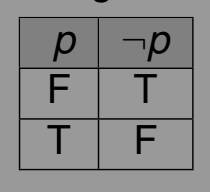

--- 
title: "ITPC 104 -- Discrete Structures"
author: "Robert Liwag"
date: "2020-06-11"
cover-image: 'neg.png'   
output: ["bookdown::gitbook", "bookdown::pdf_book"]
description: Discrete Mathematics course modules
documentclass: book
link-citations: yes
bibliography:
- book.bib
- packages.bib
site: bookdown::bookdown_site
biblio-style: apalike
header-includes: \usepackage{tikz}
---

# Preface {-}

